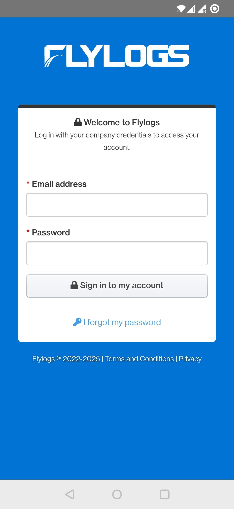
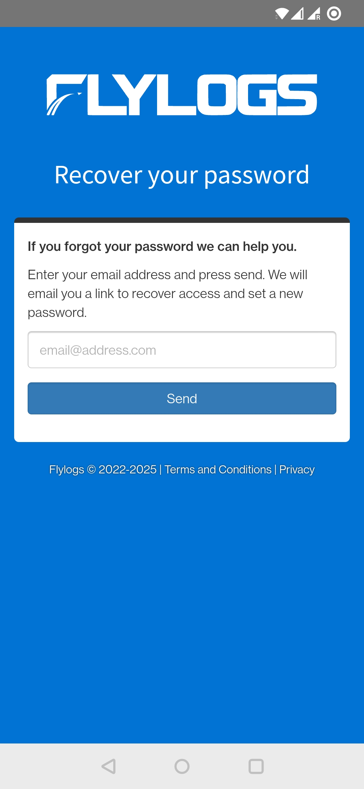

# flylogs

## Description

[Flylogs](https://flylogs.com) is a flight operations management software designed to streamline operations in flying clubs, pilot schools as well as other general and corporate aviation organizations.

This is an Android app that lets you use Flylogs without opening it in the browser. It gives you faster access and a better experience on your phone.

